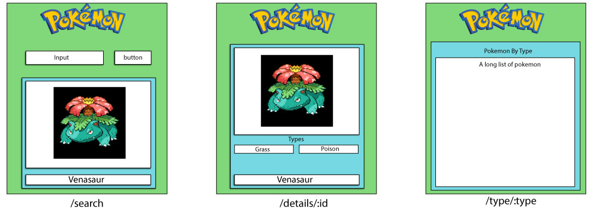

# WPX5-Hackathon-App

## Who's that Pokemon

Create an App using create-react-app that resembles the images above.

### Challenges

- Include three views:
    - Search Page
    - Details Page
    - Type page

- Utilize Pokeapi for Pokemon Data
    - The images can be found at `.data.sprites.front_default` in the response.
        - **Sub Challenge** (10 pts):
            - Make it so when the search page loads, it will pick a random number from 1 - 500 and show that Pokemon.

- Change the text color based off of the pokemons type, ex: red=fire, blue=water, green=grass

### Pages

- Search
    - This page should show the appropriate Pokemon based on search.
    - When the user clicks on the name or the image it should route them to the details page of that pokemon.

- Details

    - Should show the same pokemon as the one that was searched for and clicked. 
    - Show as much information as you want but at least include the specific pokemons' type. (10 pts per category of information)
    - When the user clicks a type, it should route them to the types page with that type.

- Type

    - This page will show all pokemon based of the type parameter. You can make a call using `http://pokeapi.co/api/v2/type/{INSERT TYPE HERE}`
    - If the user clicks on a name of a pokemon on this page, it will link back to the details page of that pokemon.

## Points System

- 10 pts per page completed.

- 10 pts for showing a random pokemon when search page mounts.

- 10 pts per route

- 10 pts per category of information on the details page.

- 20 pts for the first person that reads down this far AND tells Brent that **he is the man**.

- 10 pts for each additional API used outside of `pokeapi.co`

- 10 pts for changing text color based on type.

- 30 pts for doing this (in one way or another) with the star wars API. 

- 5 pts for not being Ali or Drew.

### Good Luck!

